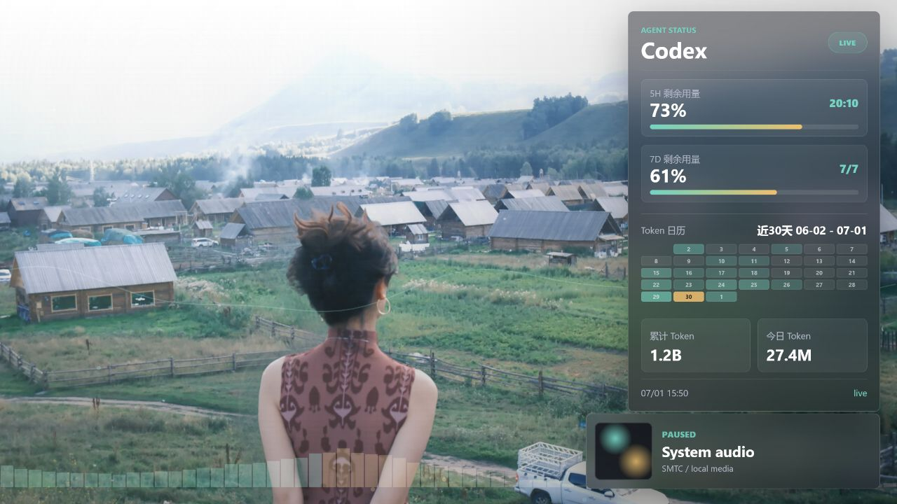

# AI Agent Usage Wallpaper / Codex Agent Usage Visualizer

Language: [中文](README.md) | English

Turn your desktop into a live quota, token, and media dashboard for Codex and other AI agents.



## Who This Is For

- People who use Codex, Claude Code, Cursor, Gemini CLI, Aider, or custom agents every day.
- People who want to see remaining 5H / 7D quota windows without opening another status page.
- People who want token usage to feel measurable instead of mysterious.
- Anyone who wants a calm Wallpaper Engine dashboard for AI quota, token history, media artwork, and subtle motion.

## Highlights

- **Multi-agent ready**: ships with a Codex local adapter, but any agent can write the same JSON file or expose the same HTTP schema.
- **Desktop quota dashboard**: shows 5H, 7D, or custom quota windows with remaining percentage and reset time.
- **Token calendar**: a 30-day token heatmap inspired by GitHub contribution graphs.
- **Local-first**: the Codex adapter only reads local `~\.codex\sessions` usage/rate-limit events. It does not read auth files, cookies, browser state, or account credentials.
- **Native Wallpaper Engine media artwork**: uses Wallpaper Engine's built-in media integration for track title, artist, and album art.
- **Bring your own image**: change the background image, fit mode, panel position, clock/player position, color, and opacity from Wallpaper Engine properties.
- **Subtle audio response**: desktop audio gently drives background brightness, saturation, and ambient glow without covering the image.

## Multi-Agent Data Sources

The package includes a Codex adapter that reads cached usage/rate-limit events from the local Codex app. Other agents can be connected without changing the wallpaper UI:

- Claude Code / Cursor / Gemini CLI / Aider / OpenHands / your own agent.
- Write `agent-status.local.json`.
- Or expose an HTTP endpoint such as `http://127.0.0.1:47622/status`.
- As long as the endpoint returns the shared JSON schema below, the wallpaper can display provider name, quota windows, daily tokens, total tokens, and today's tokens.

This wallpaper is not locked to Codex. Codex is just the included adapter. Any local or remote agent can feed the same JSON schema and become the dashboard provider.

## Import Into Wallpaper Engine

1. Open Wallpaper Engine Editor.
2. Create a Web wallpaper and select `index.html` from this folder, or drag the whole `codex-agent-wallpaper` folder into the editor.
3. In Wallpaper Engine properties, configure the background image, Agent data URL, refresh interval, panel position, clock/player position, color, and opacity. The default refresh interval is 300 seconds.
4. Publish it or apply it to your desktop.

The entry point is `index.html`, and Wallpaper Engine properties live in `project.json`. Audio processing is enabled through `general.supportsaudioprocessing`.

## Layered Wallpaper Assets

The default scene uses a 2.5D asset pack. The original delivery included a clean plate, transparent person layer, person mask, 16-bit depth map, 8-bit depth preview, QA contact sheet, and parallax preview video.

To reduce Wallpaper Engine memory usage and package size, the project uses runtime assets generated at 2560px width:

- `scene-clean-plate.webp`: background clean plate.
- `scene-person-layer.webp`: transparent foreground person layer.
- `scene-depth-preview.webp`: depth preview kept for possible future shader/depth displacement work.
- `scene-asset-manifest.json`: records the original asset pack and generated runtime assets.

The current parallax effect uses the clean plate plus transparent person layer. Pixel-level depth-map displacement would require a WebGL shader or Three.js mesh workflow, which is intentionally not enabled yet to avoid extra memory usage and edge artifacts.

## Agent Data Source

Static browser preview reads `agent-status.sample.json` by default. To connect another agent, provide the same JSON shape through a file or HTTP endpoint. A generic JSON file server is included:

```powershell
powershell -ExecutionPolicy Bypass -File .\tools\agent-status-server.ps1
```

Then set Wallpaper Engine property `Agent 数据源 URL` to:

```text
http://127.0.0.1:47621/status
```

The server reads `agent-status.local.json` by default. If that file does not exist, it falls back to `agent-status.sample.json`. You can copy `agent-status.local.example.json` to `agent-status.local.json`, then let Codex, Claude, Cursor, or your own script update it.

## Local Codex Usage Adapter

The project also includes `tools/codex-usage-export.py`. It reads rollout usage events from the current Windows user's `~\.codex\sessions` directory. User-specific Codex paths are not hard-coded.

- `payload.info.last_token_usage`: aggregated into weekly/monthly/daily token stats.
- `payload.rate_limits.primary`: Codex's 5-hour window usage percentage.
- `payload.rate_limits.secondary`: Codex's 7-day window usage percentage.

Start the live local endpoint:

```powershell
.\start-codex-usage-server.cmd
```

The launcher resolves Python in this order:

1. `CODEX_USAGE_PYTHON` environment variable.
2. The current user's bundled Codex Python, such as `~\.cache\codex-runtimes\...\python.exe`.
3. System `python` from PATH.

If Codex Home is not in the default location:

```powershell
powershell -ExecutionPolicy Bypass -File .\tools\run-codex-usage-export.ps1 -Serve 47622 -CodexHome "D:\your\.codex"
```

Then keep Wallpaper Engine property `Agent 数据源 URL` as:

```text
http://127.0.0.1:47622/status
```

Album art does not depend on this local endpoint. In Wallpaper Engine, the wallpaper uses Wallpaper Engine's official media integration API. The local service only keeps a browser-preview fallback endpoint:

```text
http://127.0.0.1:47622/media
```

That fallback tries to call Windows `GlobalSystemMediaTransportControlsSessionManager` (SMTC/GSMTC), which can be unavailable on some Windows setups. The actual Wallpaper Engine runtime does not rely on it for album art.

Install the local endpoint once and auto-start it on login:

```powershell
.\install-autostart.cmd
```

The installer first tries to register a current-user scheduled task named `CodexUsageWallpaperServer`. If Windows denies that operation, it falls back to a hidden startup script in the current user's Startup folder. Uninstall:

```powershell
.\uninstall-autostart.cmd
```

Export a one-time static JSON file:

```powershell
.\export-codex-usage-once.cmd
```

The adapter does not read `auth.json`, cookies, browser login state, prompts, or account credentials. It only reads local usage/rate-limit records already written by Codex.

## JSON Schema

```json
{
  "provider": "Codex",
  "updatedAt": "2026-06-30T20:20:00+08:00",
  "quota": {
    "mode": "percent",
    "label": "1 week",
    "usedPercent": 31,
    "remainingPercent": 69,
    "resetsAt": "2026-07-07T14:01:00+08:00",
    "windows": [
      {
        "label": "5H",
        "usedPercent": 26,
        "remainingPercent": 74,
        "resetsAt": "2026-07-01T14:01:00+08:00"
      },
      {
        "label": "7D",
        "usedPercent": 31,
        "remainingPercent": 69,
        "resetsAt": "2026-07-07T14:01:00+08:00"
      }
    ]
  },
  "tokens": {
    "week": 250000,
    "month": 1100000,
    "today": 42000,
    "total": 5300000,
    "daily": [
      { "date": "2026-06-24", "tokens": 92000 },
      { "date": "2026-06-25", "tokens": 300000 }
    ]
  },
  "agents": [
    {
      "name": "5H remaining usage",
      "remainingPercent": 74,
      "resetsAt": "2026-07-01T14:01:00+08:00"
    }
  ]
}
```

The Codex adapter automatically generates this percentage-based structure. For older data sources, the wallpaper can still read `quota.usedMinutes`, but Codex quota is no longer displayed as time.

## Local Preview

Wallpaper Engine does not need a static web server. For browser preview, use the included server:

```powershell
node .\tools\static-server.mjs
```

Open:

```text
http://127.0.0.1:5173/
```

Normal browsers do not expose Wallpaper Engine's audio API, so the preview uses simulated audio. Once imported into Wallpaper Engine, it uses real desktop audio.

## About Codex / Agent Quota

The Codex adapter reads usage/rate-limit events cached locally by the Codex app. It does not log in to your account and does not read authentication files. Other agents can integrate by writing the same JSON file or serving the same HTTP response.
